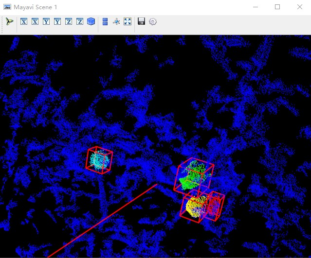

# Agriculture 3D

### Requirements
```bash
pip install open3d==0.9 open3d-python==0.7 vtk mayavi
```

### Data Preprocessing
- [x] Generate annotation file
    ```bash
    cd data
    python preprocess.py --data_dir ${your_data_dir} --anno_file ${your_anno_file}
    ```
 
- [x] Visualize annotation
    ```bash
    cd data
    python preprocess.py --data_dir ${your_data_dir} --anno_file ${your_anno_file} --vis
    ```
    